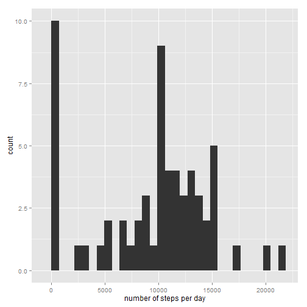
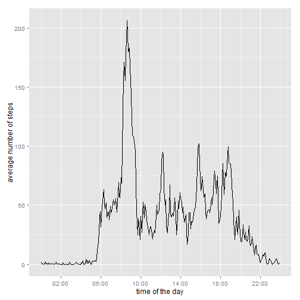
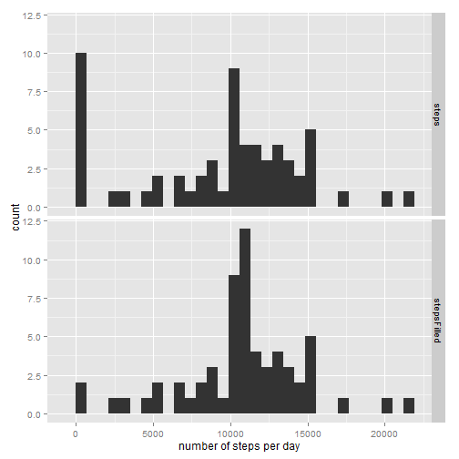
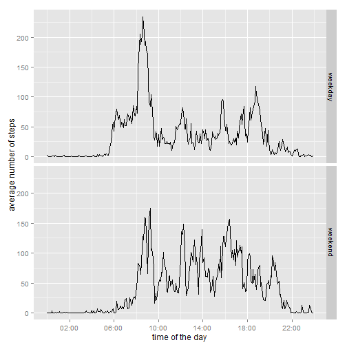

## Introduction
Nowadays, activity monitoring devices are able to collect a large amount of data about personal movement. These devices are used by the "quentified self" movement, a group of people that take measurements of their movement, to improve health, to find patterns in their behavior, or because they are just interested in this new technology. 

## Data
Data obtained from an activity monitoring device were used in this analysis. The data were sampled with 5-minute intervals, over a period of 2 months (October and November, 2012). In total the dataset contains 17,568 observations. The dataset contains data of the number of steps taken during these 5-minute intervals. 

The variables of the dataset are:

* *steps*: Number of steps taking in a 5-minute interval (missing values are coded as NA)

* *date*: The date on which the measurement was taken in YYYY-MM-DD format

* *interval*: Identifier for the 5-minute interval in which measurement was taken

## Loading and preprocessing the data
Set the working directory to the folder of the Github repository on your local computer. And load the data from the comma-separated file ("activity.csv") into a data frame called *data*.

```r
setwd("D:/personal/courses/data science/5. reproducible research/assessments/assessment 1/RepData_PeerAssessment1/")
data <- read.csv("activity.csv")
```

In the original dataset, the *interval* variable is not in the proper format for this data analysis. The data in the interval variable are of the integer class and need to be transformed into a Date class. The data in the *interval* variable are in the following format: hhmm, where 'hh' denotes hours and 'mm' minutes. The data are first separated in hours and minutes and, subsequently, glued together using the **paste** function, separating them with a colon (':'). A new variable is created (*datetime*) that includes both the date and the time for each observation. The **as.POSIXct** function is used to convert the new *time* and *datetime* variables to 'POSIXct' class. An arbitrary date ('2015-05-07') is added to the *time* variable to be able to use the variable in further analysis. This arbitrary date does not affect the analysis in any way.


```r
library(lubridate)
data$time <- paste(floor(data$interval/100), round((data$interval/100-floor(data$interval/100))*100), sep = ":")
data$datetime <- as.POSIXct(paste(data$date, data$time))
data$time <- as.POSIXct(paste("2015-05-07", data$time))
```

## Mean total number of steps taken per day

The mean total number of steps per day is calculated by grouping the data by *date* and taking the sum of each day. A new data frame is created (*dailySteps*) that contains the total number of steps, specified per day. In this part of the report, NA values are ignored. 

```r
library(dplyr)
dailySteps <- data %>% group_by(date) %>% summarize(steps = sum(steps, na.rm = TRUE))
```

Below you will find a histogram of the number of steps per day. 

```r
library(ggplot2)
a <- ggplot(dailySteps, aes(steps))
a + geom_histogram() + labs(x = "number of steps per day")
```

 

The mean and median total number of steps taken per day are determined using the **mean** and **median** functions, respectively. The mean is subsequently rounded to an integer, to be able to compare it well with the median value.

```r
dailyMean <- round(mean(dailySteps$steps, na.rm = TRUE), digits = 0)
dailyMedian <- median(dailySteps$steps, na.rm = TRUE)
```
The mean and median total number of steps per day are 9354 and 10395, respectively.

## Average daily activity pattern

Data were obtained in 5-minute intervals. Here I calculated the average number of steps taken per 5-minute periode, averaged across all days. To do so, the data were grouped by *time* and the average number of steps were calculated for each 5-minute interval. The data were stored in a new data frame *intervalSteps*. Below you will find a figure that shows a time-series of the average number of steps per 5-minute interval. 

```r
library(dplyr)
library(scales)
intervalSteps <- data %>% group_by(time) %>% summarize(steps = mean(steps, na.rm = TRUE))
ggplot(intervalSteps, aes(time, steps)) + geom_line() + xlab("time of the day") + ylab("average number of steps") + scale_x_datetime(breaks = date_breaks('4 hours'), labels = date_format("%H:%M"))
```

 

To calculate the 5-minute interval, which on average across all the days, contains the maximum number of steps, I used the **which.max** function. The function was applied to the steps variable of the *intervalSteps* data frame. The arbitrary date is removed from the variable to be able only to get the time. Also the next interval is determined to be able to show the proper 5-minute interval.

```r
intervalMax1 <- format(intervalSteps$time[which.max(intervalSteps$steps)], "%H:%M")
intervalMax2 <- format(intervalSteps$time[which.max(intervalSteps$steps)+1], "%H:%M")
```
On average, the interval 08:35 - 08:40 contains the maximum number of steps, averaged across all the days in the datasets.

## Imputing missing values

There are a number of days/intervals where there are missing values (coded as NA). The presence of missing days may introduce bias into some calculations or summaries of the data. The total number of missing values is calculated below, using the **is.na** function and summing the obtained logical vector.

```r
totalNA <- sum(is.na(data$steps))
```
The data set contains a total number of 2304 missing values.

A strategy is devised to fill the missing values in the dataset. The strategy is as follows. In the previous section, I obtained the average daily activity pattern, averaged across all days. The obtained dataset is used to fill the missing values. First I created a new variable *stepsFilled*, which is set equal to the original *steps* variable. Second, I created a for-loop, which loops to all the missing values. For each missing value, the 5-minute interval is determined and the missing value (NA) is replaced by the value of the 5-minute interval from the *intervalSteps* data frame.

```r
data$stepsFilled <- data$steps
for (i in which(is.na(data$stepsFilled))) {
    data$stepsFilled[i] <- intervalSteps$steps[intervalSteps$time == data$time[i]]
}
```

The following step is to compare the dataset with missing values and the dataset with the missing values replaced. To do so, the steps taken to create the histogram and the mean and median values are repeated for the filled dataset.

The mean total number of steps per day is calculated by grouping the data by *date* and taking the sum of each day. A new data frame is created (*dailyStepsFilled*) that contains the total number of steps, specified per day, for the filled dataset. 

```r
library(dplyr)
dailyStepsFilled <- data %>% group_by(date) %>% summarize(steps = sum(steps, na.rm = TRUE), stepsFilled = sum(stepsFilled))
```

Below you will find a histogram of the number of steps per day. The histogram also contains the data from the previous analysis, when the missing values were ignored. The lower panel shows that when the missing values are filled, the number days with very low number of steps (close to 0) decrease. While the total of days with a total number of steps around 10,000 increase.

```r
library(ggplot2)
dataHistogram <- rbind(data.frame(fill="steps", obs=dailyStepsFilled$steps),
            data.frame(fill="stepsFilled", obs=dailyStepsFilled$stepsFilled))

ggplot(dataHistogram, aes(x=obs)) + geom_histogram(position="dodge") + labs(x = "number of steps per day", y = "count") + facet_grid(fill ~ .)
```

 

The mean and median total number of steps taken per day are determined using the **mean** and **median** functions, respectively. The mean is subsequently rounded to an integer, to be able to compare it well with the median value.

```r
dailyMeanFilled <- as.integer(mean(dailyStepsFilled$stepsFilled, na.rm = TRUE))
dailyMedianFilled <- as.integer(median(dailyStepsFilled$stepsFilled, na.rm = TRUE))
```
The mean total number of steps per day changes from  9354 to 10766, when missing values are replaced. And the median total number of steps per day changes from 10395 to 10766, when missing values are replaced. These numbers show that the total number of steps increases when missing values are replaced.

## Differences in activity patterns between weekdays and weekends

In the last part of the analysis, I focussed on the difference between activity patterns between weekdays and weekends. First, I set the locale to English, otherwise there might be a problem with the names of the day. Then, I created a new variable called *week*. I filled the new variable with the character value "weekday". Finally, I find all the days that are either "Saturday" or "Sunday" and replace the values in the variable *week* with "weekend".

```r
Sys.setlocale("LC_TIME", "English")
```

```
## [1] "English_United States.1252"
```

```r
data$week <- "weekday"
data$week[weekdays(data$datetime) == "Saturday" | weekdays(data$datetime) == "Sunday"] <- "weekend"
```

I created a new data frame *intervalStepsWeek* with the average number of steps for both the weekdays and weekends. To do so, I grouped the data by *time* and *week* and I took the **mean** for the grouped variables. The figure below shows the time-series of the 5-minute intervals, separated by weekdays and weekends. The figure clearly shows that in weekdays, there is an increased number of steps in the morning, especially between 8:00 and 10:00. During the rest of the day, the activity is higher in the weekend. 

```r
library(dplyr)
library(scales)
intervalStepsWeek <- data %>% group_by(time, week) %>% summarize(stepsFilled = mean(steps, na.rm = TRUE))
ggplot(intervalStepsWeek, aes(time, stepsFilled)) + geom_line() + xlab("time of the day") + ylab("average number of steps") + facet_grid(week ~ .) + scale_x_datetime(breaks = date_breaks('4 hours'), labels = date_format("%H:%M"))
```

 
